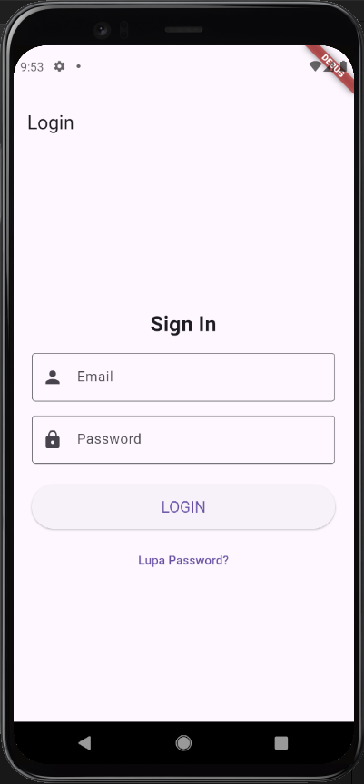
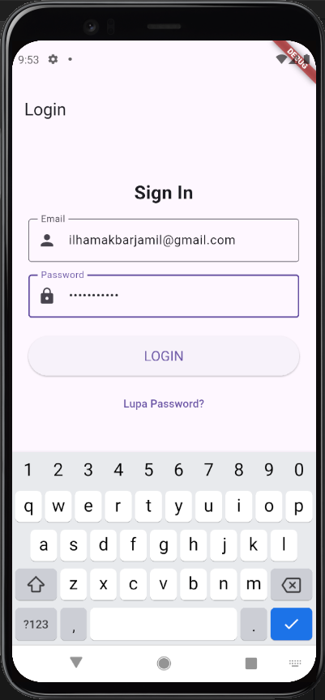
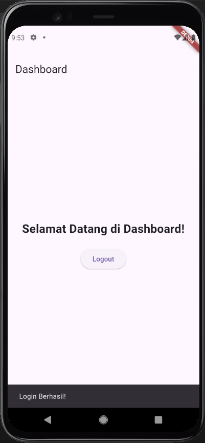

# Proyek Halaman Login & Dashboard Flutter (Versi Manual)

## Deskripsi Proyek

Proyek Flutter ini adalah implementasi halaman login dan dashboard yang dikembangkan secara manual untuk memenuhi persyaratan tugas tertentu. Versi ini menekankan pada pendekatan pengembangan tradisional, di mana setiap komponen UI dan logika ditulis secara eksplisit oleh pengembang.

Tujuannya adalah untuk menunjukkan pemahaman mendalam tentang setiap widget Flutter, bagaimana responsivitas diimplementasikan, dan bagaimana fitur-fitur dasar seperti validasi formulir dan navigasi dikelola tanpa bantuan alat bantu AI eksternal dalam proses pembuatan kode.

## Tampilan Aplikasi

Berikut adalah beberapa tangkapan layar dari aplikasi ini:

### Halaman Login (Versi Manual - Dasar/Kreatif)
<!-- Sisipkan screenshot halaman login versi manual di sini. Jika Anda memiliki dua versi manual (dasar dan kreatif), Anda bisa menampilkan keduanya atau memilih salah satu. Contoh: -->

### Halaman Dashboard (Versi Manual - Dasar)
<!-- Sisipkan screenshot halaman dashboard versi manual di sini. Contoh: -->

## Fitur Utama (Versi Manual)

### Halaman Login (`login_page_manual.dart` atau `login_page_manual_creative.dart`)
*   **Desain:** Tersedia dalam dua varian:
    *   **Basic:** Desain minimalis dan fungsional dengan elemen UI standar.
    *   **Creative:** Desain yang lebih modern dan menarik, menggunakan gradient, shadow, dan bentuk yang lebih dinamis.
*   **Validasi Formulir:** Input email dan password dengan validasi real-time untuk memastikan data yang benar.
*   **Animasi Tombol:** Tombol login memiliki animasi skala (mengecil saat ditekan) untuk memberikan umpan balik interaktif.
*   **Responsif:** Menggunakan `MediaQuery` untuk menyesuaikan tampilan secara otomatis berdasarkan ukuran dan orientasi layar.
*   **Logo Aplikasi:** Penempatan logo yang jelas di bagian atas formulir.
*   **Navigasi:** Setelah login berhasil, pengguna akan diarahkan ke halaman dashboard.

### Halaman Dashboard (`dashboard_page.dart`)
*   **Desain Dasar:** Tampilan dashboard yang sederhana namun fungsional, menampilkan pesan selamat datang.
*   **Tombol Logout:** Tombol untuk kembali ke halaman login.
*   **Navigasi Kembali:** Menggunakan `Navigator.pushReplacementNamed` untuk kembali ke halaman login setelah logout.

## Kredensial Demo

Untuk menguji fungsionalitas login, gunakan kredensial berikut:

*   **Email:** `user@example.com`
*   **Password:** `password123`

## Struktur Proyek